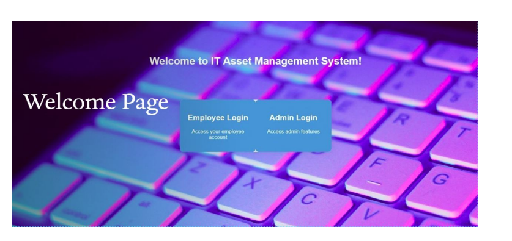
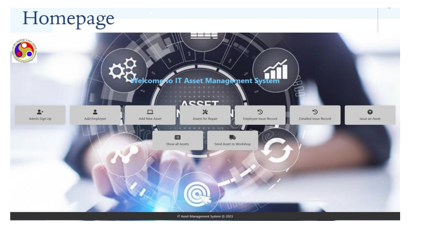

# IT Asset Management System

## Streamlining IT Asset Management for Optimal Efficiency

---

## Introduction

In today’s dynamic business landscape, effective IT asset management is crucial for organizational success. The IT Asset Management System offers a user-friendly, feature-rich platform designed for administrators and authorized personnel, ensuring seamless management of IT assets across various domains.

---

## Key Features

- **User Authentication and Administration**
  - Secure login and admin sign-up for efficient role management and access control.

- **Employee Management**
  - Centralized database for managing personnel information, enabling easy addition of new employees.

- **Asset Addition and Tracking**
  - Simplified process for adding new IT assets, ensuring a comprehensive and easily trackable inventory.

- **Asset Maintenance and Repair**
  - Dedicated module for proactive identification and tracking of assets requiring maintenance or repair.

- **Issue Tracking**
  - Detailed records of issued assets to promote transparency and accountability in asset management.

- **Detailed Asset Records**
  - Granular access to asset records for an in-depth understanding of asset utilization and history.

- **Workshop Integration**
  - Streamlined process for sending assets to workshops, ensuring efficient maintenance and repair tracking.

---

## Design and Implementation

Our system features a modern, intuitive web design that enhances the user experience while maintaining a secure and scalable database architecture. The responsive design principles ensure compatibility across a wide range of devices, providing a consistent and accessible user interface.

---

## Project Workflow

### User Authentication and Administration

- **User Login:** Administrators log in securely with their credentials.
- **Admin Dashboard:** Provides access to a variety of administrative functionalities.
- **Admin Sign-Up:** Allows for the seamless addition of new administrators.

### Employee Management

- **Employee Addition:** Administrators can easily add new employees with all relevant details.
- **Employee Database:** Centralized repository for managing employee information.

### Asset Addition and Tracking

- **Add New Asset:** Administrators can efficiently add IT assets with details such as ID, name, and acquisition date.
- **Asset Tracking:** The system tracks all assets, including their status and activity history.

### Asset Maintenance and Repair

- **Identify Maintenance Needs:** Administrators and employees can identify and manage assets that require maintenance.
- **Maintenance Records:** The system maintains comprehensive records of maintenance activities for each asset.

### Issue Tracking

- **Issue an Asset:** Employees can issue assets with relevant details, ensuring proper documentation.
- **Return Status:** The system tracks the return status of issued assets to ensure accountability.

### Workshop Integration

- **Send Asset to Workshop:** Administrators can initiate and track the maintenance process for assets sent to workshops.
- **Workshop Record:** Detailed records are maintained for assets undergoing workshop maintenance.

---

## Homepage Design and Features

- **Logo and Header:** The logo is prominently displayed, with a strategically designed header for enhanced visual appeal.
- **Welcome Message:** A well-crafted welcome message in dark blue enhances readability and sets a positive tone for users.
- **Options Container:** The main section features quick-action buttons in a green color scheme, designed to enhance user engagement.

---

Experience the future of IT asset management with our user-centric, streamlined, and efficient system.

